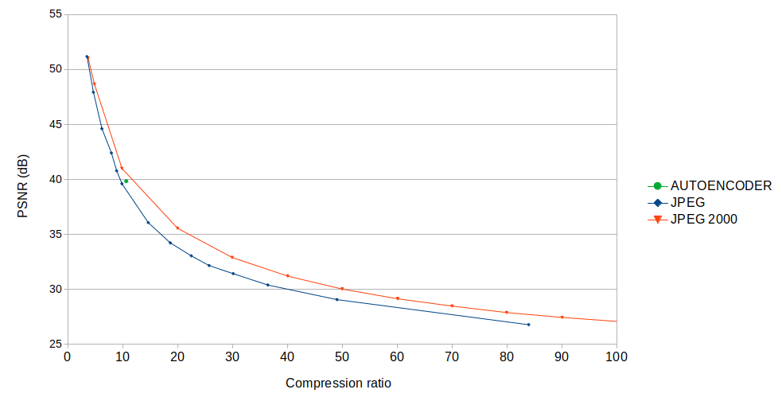

# Face images compressor

The aim of this project is to experiment with deep learning autoencoders for coding images where there is typically a person in the foreground over a mostly static background. Our aim is to explore deep neural network architectures suitable for efficient communication on video conferencing use cases.

Our current approach is to simplify the video coding task by treating a video as a set of individual frames, rather than as a sequence. Accordingly, our dataset is a subset of individual frames collected from the VoxCeleb2 video dataset.

As of today, we provide a working PyTorch implementation of the deep learning architecture from the paper "Lossy image compression with compression autoencoders", by Lucas Theis, Wenzhe Shi, Andrew Cunningham & Ferenc Husz, published in 2017 (see the [original paper](https://arxiv.org/pdf/1703.00395v1.pdf) for details). While the original paper described a Theano implementation we have implemented and trained our own models in PyTorch, being able to reproduce the results from the paper.

This repo contains the PyTorch implementation and a training Jupyter notebook that downloads our dataset and pre-trained models, hosted in DropBox. The code was made open source in the hope of encouraging machine learning practitioners to use it as a baseline in their own research.

# How good are the results compared to standard compression methods?

The quality of our best codec lays between classical JPEG and JPEG2000, suggesting that further work on the field can certainly lead to a breakthrough. See the green dot in the following graph, where the PSNR for different compression ratios was plotted. That green dot marks the place of 39.8 dB of PSNR for a 10.66 compression ratio achieved by our best codec so far.

The data for JPEG and JPEG2000 was borrowed from an independent group of researchers. That data was extracted by reverse engineering the plot from figure 10 in the paper "JPEG vs. JPEG2000: An Objective Comparison of Image Encoding Quality", by Farzad Ebrahimi, Matthieu Chamik and Stefan Winkler, published in 2004.

The figure was digitized to a .csv file by means of the Web Plot Digitizer tool (available [here](https://apps.automeris.io/wpd/) as of 21st August 2020). The resulting .csv file was then loaded in LibreOffice Calc and complemented with the data from my autoencoder-based codec.

# Google Colab setup

The easiest way to experiment with the provided models is possibly to load [train.ipynb](train.ipynb) in Google Colab. This workflow is especially useful if you only intend to browse the TensorBoards for the different models.

Open the file and run all the cells in order to download the dataset, trained models and TensorBoard logs.

# Workstation setup

If you intend to do more serious work you may want to setup your own development machine following the instructions from this section.

- Install opencv and jupyter packages on Ubuntu (or the equivalent for your preferred OS):

`sudo apt-get install python-opencv`

- Install the needed python packages:

`pip3 install psutil scikit-image opencv-python pytest torchvision pandas tqdm torch runipy tensorboard`

- Double check you have CUDA support by checking the following command line prints "True" rather than "False":

`(echo "import torch"; echo "torch.cuda.is_available()") | python3 -i`

- Double check you have pytorch 1.4 installed in your system:

`(echo "import torch"; echo "torch.__version__") | python3 -i`

- Clone the repo:

`git clone git@github.com:abel-bernabeu/autoencoder.git`

- Change directory to "autoencoder":

`cd autoencoder`

- Run the training notebook to get the latest version of the dataset and trained models:

`runipy train.ipynb`

# Test suite

All the unit and integration tests are discovered with "pytest" introspection, so you just need to type one command for executing them all:

`pytest`

# License

Autoencoder is BSD-style licensed, as found in the [LICENSE](LICENSE) file.
